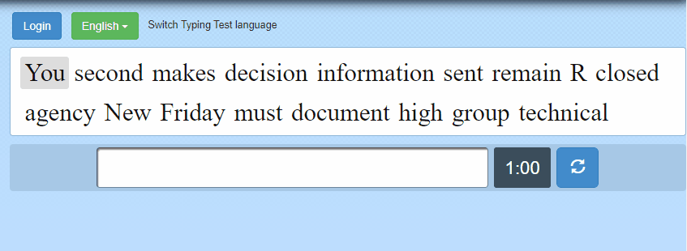
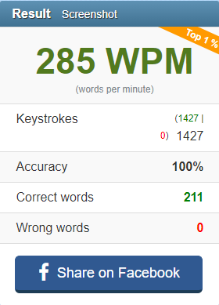

# Typing Test

This is an automation script that will take a typing test on 10fastfingers.com and take a screenshot the results after the test is complete. 

### Prerequisites

To run this script, you must have selenium installed on your machine as well as the webdriver you want to you. Instructions to install [selenium here.](https://selenium-python.readthedocs.io/installation.html)

This project includes chromedriver 84.0.4147.30 which only works on that version of Chrome. If you have a different version, you can find the appropriate [chromedrivers here.](https://chromedriver.chromium.org/)

## Built With

* [Python](https://www.python.org/)

* [Selenium](https://selenium-python.readthedocs.io/)
